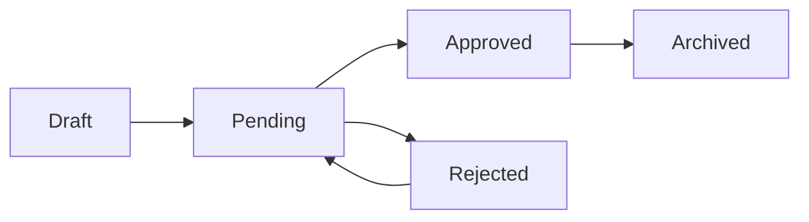

## Overview

This page documents how approvers take action on items awaiting their approval. While there's no dedicated "update approval" endpoint, approval actions are taken through entity-specific endpoints.

<Warning>
  There is no direct `PATCH /approval-workflows/{id}` endpoint. To modify a workflow, create a new workflow and deactivate the old one by setting `isActive: false`.
</Warning>

## Taking Approval Actions

Approvers take actions on specific entities (leave requests, memos) rather than on approval workflows directly. The approval system tracks these actions in the approval history.

### Available Actions

When reviewing an item, approvers can take one of three actions:

<CardGroup cols={3}>
  <Card title="Approve" icon="check" color="#10b981">
    Accept the request and advance to the next approval step. If this is the final step, the request becomes fully approved.
  </Card>
  
  <Card title="Reject" icon="xmark" color="#ef4444">
    Deny the request. This ends the approval process and sets the request status to rejected.
  </Card>
  
  <Card title="Request Changes" icon="pen" color="#f59e0b">
    Ask the submitter to modify the request before it can be approved. The submitter must update and resubmit.
  </Card>
</CardGroup>

## Approval Workflow Process

<Steps>
  <Step title="Submission">
    An employee submits a leave request or memo that requires approval
  </Step>
  
  <Step title="Workflow Assignment">
    The system identifies the appropriate approval workflow based on:
    - Entity type (leave/memo/expense)
    - Employee's department (department-specific or company-wide workflow)
    - Workflow active status
  </Step>
  
  <Step title="Step 1 Approval">
    The first approver (based on workflow step 1) receives the item for review and can approve, reject, or request changes
  </Step>
  
  <Step title="Subsequent Steps">
    If approved, the item moves to step 2, then step 3, etc., until all workflow steps are completed
  </Step>
  
  <Step title="Final Status">
    Once all approvers approve, the request status becomes "approved". If any approver rejects, the status becomes "rejected".
  </Step>
</Steps>

## Entity-Specific Approval Endpoints

Approval actions are taken through the specific entity endpoints:

### Leave Requests

```http
PATCH /leave-requests/{id}/approve
PATCH /leave-requests/{id}/reject
```

### Memos

```http
PATCH /memos/{id}/approve
PATCH /memos/{id}/reject
```

<Info>
  See the respective entity documentation (Leave Requests API, Memos API) for detailed request/response schemas for approval actions.
</Info>

## Modifying Approval Workflows

To update an existing approval workflow:

<Steps>
  <Step title="Create New Workflow">
    Use the [Create Approval Workflow](/api/approvals/create) endpoint to create a new workflow with the updated configuration
  </Step>
  
  <Step title="Test New Workflow">
    Verify the new workflow works correctly with test submissions
  </Step>
  
  <Step title="Deactivate Old Workflow">
    Once confirmed, you can deactivate the old workflow by creating a new one with the same parameters but `isActive: false`, or by implementing a deactivation endpoint
  </Step>
</Steps>

<Note>
  Existing in-progress approvals continue using the workflow they started with. Only new submissions use the newly activated workflow.
</Note>

## Status Transitions

Entities flow through these statuses during the approval process:



<AccordionGroup>
  <Accordion title="Draft">
    Initial status when an employee is preparing a request but hasn't submitted it yet. Not yet in the approval workflow.
  </Accordion>
  
  <Accordion title="Pending">
    Submitted and awaiting approval. The `current_step` field indicates which approval step it's at.
  </Accordion>
  
  <Accordion title="Approved">
    All required approvers have approved the request. It has completed the full workflow successfully.
  </Accordion>
  
  <Accordion title="Rejected">
    At least one approver rejected the request. Depending on business rules, it may be resubmitted (returning to Pending).
  </Accordion>
  
  <Accordion title="Archived">
    The request is complete and has been archived for record-keeping. Typically applied to approved requests after completion.
  </Accordion>
</AccordionGroup>

## Current Step Tracking

Entities in approval workflows have a `current_step` field that indicates:

- **Step 1**: Awaiting first approver
- **Step 2**: First approval complete, awaiting second approver
- **Step N**: Awaiting Nth approver

Query the entity to see its current step and compare against the workflow definition to determine who the current pending approver is.

## Approval Permissions

Who can approve depends on the workflow step configuration:

<CodeGroup>
```json Role-Based Approval
{
  "step": 1,
  "role_id": "manager-role-uuid",
  "approver_id": null
}
// Any user with the manager role can approve
```

```json Specific Approver
{
  "step": 2,
  "role_id": "hr-manager-role-uuid",
  "approver_id": "john-doe-uuid"
}
// Only John Doe can approve this step
```
</CodeGroup>

## Best Practices

<Check>
  **Track approval history**: Use the [Get Approval History](/api/approvals/get) endpoint to display who approved what and when
</Check>

<Check>
  **Provide clear comments**: Encourage approvers to add comments explaining their decision, especially when rejecting or requesting changes
</Check>

<Check>
  **Set reasonable workflow lengths**: Too many approval steps slow down processes. 2-3 steps is typical for most workflows
</Check>

<Check>
  **Use role-based approvals**: Prefer role-based approval (null `approver_id`) over specific approvers for flexibility when employees change roles
</Check>

## Related Resources

<CardGroup cols={2}>
  <Card title="Create Workflow" icon="plus" href="/api/approvals/create">
    Set up new approval workflows for your company
  </Card>
  
  <Card title="List Workflows" icon="list" href="/api/approvals/list">
    View all configured approval workflows
  </Card>
  
  <Card title="Approval History" icon="clock-rotate-left" href="/api/approvals/get">
    Review complete approval audit trail
  </Card>
  
  <Card title="Leave Requests" icon="calendar" href="/api/leave-requests">
    Manage leave request approvals
  </Card>
</CardGroup>